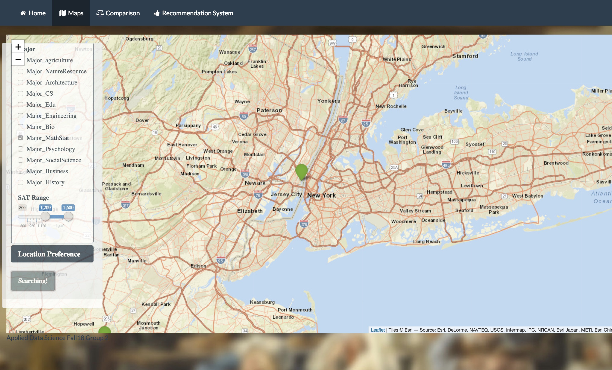

# Project 2: Shiny App Development Version 2.0: Schools Hunter

HTTPS://apdatascience.shinyapps.io/school



In this second project of GR5243 Applied Data Science, we develop a version 2.0 of an *Exploratory Data Analysis and Visualization* shiny app on a topic of your choice using [NYC Open Data](https://opendata.cityofnewyork.us/) or U.S. government open data released on the [data.gov](https://data.gov/) website. See [Project 2 Description](doc/project2_desc.md) for more details.  

### [Project Description](doc/project2_desc.md)

Term: Fall 2018

+ Team 2
+ **Schools Hunter**: + Team members:
	+  Cai, Yang yc3404@columbia.edu
	+  Chen, Yang yc3335@columbia.edu
	+  Sehgal, Atishay as5453@columbia.edu -Presenter
	+  Zhong, Chenzhong cz2486@columbia.edu
	+  Zhong, Qingyang qz2317@columbia.edu

+ **Project summary**:Our project takes all available data on colleges and universities across US and creates a useful shiny app that allows users to explore, compare and recommend the same. Our users can be anybody from prospective students, concerned parents and anybody else who wishes to see the landscape of college education in the United States.

+ **Contribution statement**: (In order of alphabetical order) Yang Cai worked on the Recommendations, Comparison and Combination of the UI. Yang Chen worked on the Map and Comparison. Atishay Sehgal worked on the Map, Comparison and Presentation. Chenzhong Zhong worked on the Comparison, Qingyang Zhong worked on the Recommendation. All team members approve our work presented in this GitHub repository including this contributions statement. 

Following [suggestions](http://nicercode.github.io/blog/2013-04-05-projects/) by [RICH FITZJOHN](http://nicercode.github.io/about/#Team) (@richfitz). This folder is orgarnized as follows.

```
proj/
├── app/
├── lib/
├── data/
├── doc/
└── output/
```

Please see each subfolder for a README file.

